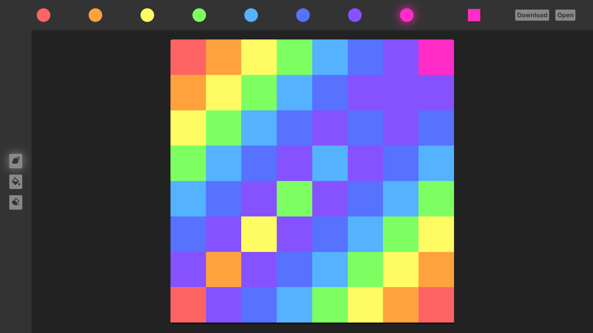

# Pixelful 🎨

A minimal, one layer pixel art editor

## Shortcuts

- `c`: Clear image
- `r`: CLear and randomize image
- `d`: Download image
- `o`: Open image
- `1-8`: Switch between color swatches
- `p`: Select Paint tool
- `f`: Select Fill tool
- `e`: Select Eraser tool

## Themes

This app uses the [Hundred Rabbits Theme System](https://github.com/hundredrabbits/Themes). To change the theme, drag and drop a theme svg onto the window.

[Get themes](https://github.com/hundredrabbits/Themes/tree/master/themes)